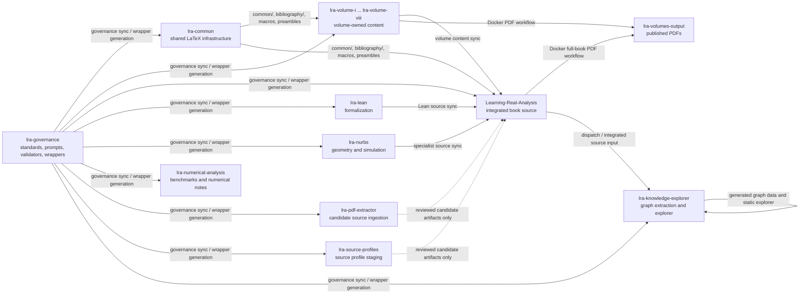
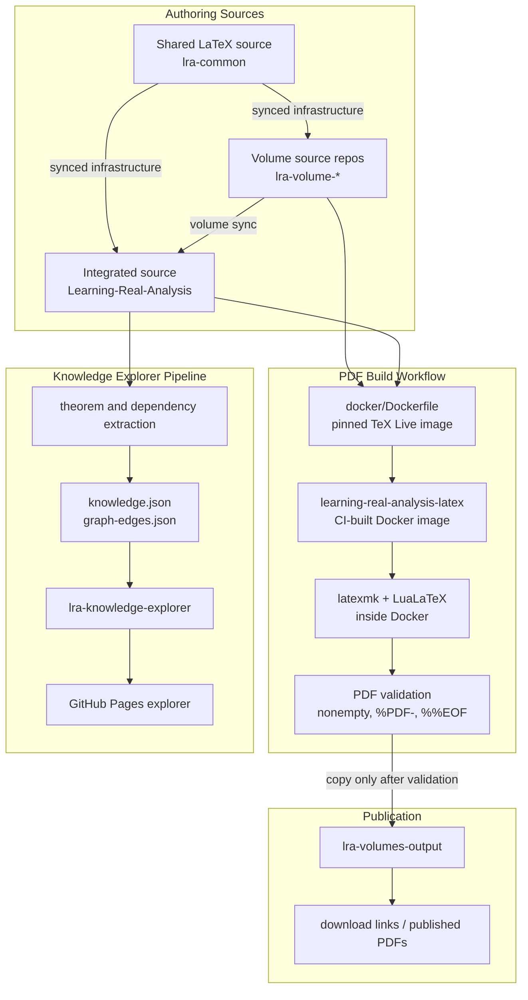

# Workflow And Data Flow Architecture

This document maps the operational workflows across the LRA repository family.
It is a routing aid: ownership rules remain in the focused architecture and
governance documents linked from `docs/architecture/README.md`.

## Repository Workflow Map

## Build, Publish, And Knowledge Data Flow

## Reading Rules

- Solid arrows are approved sync, build, or generation paths.
- Dotted arrows are staging paths that require review before content enters an
  owning source repository.
- PDF workflows must build through the checked-in Docker image definition and
  must validate the produced PDF before publishing to `lra-volumes-output`.
- Generated explorer data is derived from integrated source structure; it is
  not hand-authored in volume repositories.
